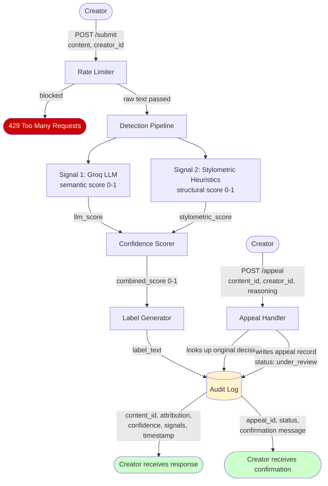

# Provenance Guard — Planning

## Architecture Narrative

A creator submits a piece of text to the platform. The request hits
the POST /submit endpoint first, where the rate limiter checks if
this user has submitted too many times recently. If they are over
the limit they get blocked. If they pass, the raw text enters the
detection pipeline.

The pipeline runs two signals in parallel. Signal 1 sends the text
to the Groq LLM (llama-3.3-70b-versatile), which reads it for
semantic meaning, tone, and phrasing patterns and returns a score
between 0 and 1. Signal 2 runs stylometric heuristics in pure
Python, measuring sentence length variance, type-token ratio, and
punctuation density, and returns its own score between 0 and 1.

The two scores are combined into a single confidence score. That
score determines which transparency label gets generated — one of
three variants: high-confidence AI, high-confidence human, or
uncertain. The full result (attribution, confidence, label, and
both signal scores) is written to the audit log and returned to
the creator.

If a creator disagrees with their label, they POST to /appeal with
their content ID and their reasoning. The system logs the appeal
alongside the original decision, flips the content status to
"under review", and returns a confirmation. No automatic
re-classification happens.

## Detection Signals

### Signal 1 — Groq LLM Classifier
- **What it measures:** Semantic meaning, tone, phrasing style,
  and contextual patterns in the writing
- **Why it differs between human and AI writing:** AI writing tends
  toward clean, balanced, well-structured prose with consistent
  tone. Human writing is messier — idiosyncratic word choices,
  emotional irregularity, unexpected tangents
- **Blind spot:** It can be steered by clever framing. A well-
  prompted AI can mimic human irregularity. It also cannot capture
  structural or statistical properties of the text.

### Signal 2 — Stylometric Heuristics
- **What it measures:** Three statistical properties — sentence
  length variance (how much sentence lengths vary), type-token
  ratio (unique words divided by total words), and punctuation
  density (how expressively punctuation is used)
- **Why it differs between human and AI writing:** AI writing is
  statistically uniform. Sentences trend toward similar lengths,
  vocabulary repeats common phrases, punctuation is sparse and
  predictable. Human creative writing is irregular and expressive.
- **Blind spot:** Cannot read meaning at all. A human who writes
  in a controlled minimalist style may score like AI. Has no
  concept of intent or context.

## Architecture

