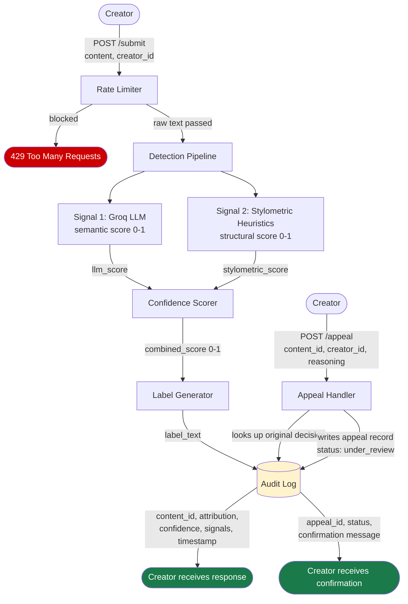

# Provenance Guard — Planning

## Detection Signals

### Signal 1 — Groq LLM Classifier
- **What it measures:** Semantic meaning, tone, phrasing style,
  and contextual patterns in the writing. The LLM is prompted to
  act as a content attribution classifier and return a structured
  JSON verdict.
- **Output format:** A score between 0.0 and 1.0 where 1.0 means
  high confidence AI-generated and 0.0 means high confidence
  human-written. Also returns a one-sentence reason.
- **Example output:**
```json
  {
    "llm_score": 0.82,
    "reason": "Uniform sentence structure and lack of personal
    voice suggest AI generation."
  }
```
- **Why it differs between human and AI writing:** AI writing tends
  toward clean, balanced, well-structured prose with consistent
  tone. Human writing is messier — idiosyncratic word choices,
  emotional irregularity, unexpected tangents.
- **Blind spot:** Can be steered by clever framing. A well-prompted
  AI can mimic human irregularity. Cannot capture structural or
  statistical properties of the text.

### Signal 2 — Stylometric Heuristics
- **What it measures:** Three statistical properties computed in
  pure Python:
  - **Sentence length variance:** Standard deviation of sentence
    lengths in words. Low variance (under 3.0) suggests AI.
  - **Type-token ratio (TTR):** Unique words divided by total
    words. Low TTR (under 0.6) suggests repetitive AI phrasing.
  - **Punctuation density:** Count of expressive punctuation
    marks (!, ?, —, ...) divided by total sentences. Low density
    (under 0.2) suggests AI.
- **Output format:** A score between 0.0 and 1.0 where 1.0 means
  high confidence AI-generated. Computed by averaging the three
  normalized sub-scores.
- **Example output:**
```json
  {
    "stylometric_score": 0.71,
    "breakdown": {
      "sentence_variance": 0.65,
      "type_token_ratio": 0.74,
      "punctuation_density": 0.73
    }
  }
```
- **Why it differs between human and AI writing:** AI writing is
  statistically uniform. Human creative writing is irregular and
  expressive.
- **Blind spot:** Cannot read meaning at all. A human who writes
  in a controlled minimalist style may score like AI. Has no
  concept of intent or context.

### How signals are combined
The two scores are combined into a single confidence score using
a weighted average:

confidence = (llm_score * 0.6) + (stylometric_score * 0.4)

The LLM signal is weighted higher (0.6) because it captures
semantic context which is harder to fake than statistical
properties. The stylometric signal (0.4) acts as a structural
check that the LLM cannot be tricked on.

---

## Uncertainty Representation

### What confidence scores mean

| Score range | Meaning | Label variant triggered |
|-------------|---------|------------------------|
| 0.0 – 0.35 | Likely human-written | High-confidence human |
| 0.36 – 0.64 | Uncertain — signals conflict or are weak | Uncertain |
| 0.65 – 1.0 | Likely AI-generated | High-confidence AI |

### Why these thresholds
The uncertain band is intentionally wide (0.36–0.64) because a
false positive — labeling a human as AI — is worse than a false
negative on a creative platform. When signals conflict, the system
defaults to uncertainty rather than accusation. A score of 0.6
means the system has a mild lean toward AI but not enough
confidence to make a strong claim. A score of 0.95 means both
signals strongly agree the content is AI-generated.

### Calibration approach
Scores are not raw model outputs — they are mapped through the
weighted average formula above. Before shipping, the system will
be tested against a set of known human-written and known
AI-generated samples to verify that scores distribute meaningfully
across the three bands rather than clustering around 0.5.

---

## Transparency Label Design

These are the exact strings the system will return and display.
They are written for a non-technical reader.

### High-confidence AI (confidence ≥ 0.65)

Our system detected patterns strongly associated with
AI-generated writing in this submission. This label does not
prevent the work from being shared — it provides context for
readers. If you wrote this yourself, you can file an appeal
and a human reviewer will take a look.

### Uncertain (confidence 0.36 – 0.64)

Our system found mixed signals in this submission and could
not make a confident determination. This content is marked
as uncertain. If you believe this label is incorrect, you
can file an appeal.

### High-confidence human (confidence ≤ 0.35)

Our system found no strong indicators of AI-generated writing
in this submission. This work appears to be human-authored.

---

## Appeals Workflow

### Who can appeal
Any creator who has a content ID from a previous submission
can submit an appeal. Only the original submitter can appeal
their own content (matched by creator_id).

### What they provide
```json
{
  "content_id": "string",
  "creator_id": "string",
  "reasoning": "string (their explanation, required)"
}
```

### What the system does on appeal
1. Looks up the original decision in the audit log using
   content_id
2. Validates that creator_id matches the original submission
3. Appends an appeal record to the audit log entry:
```json
   {
     "appeal_id": "string",
     "reasoning": "string",
     "timestamp": "string",
     "status": "under_review"
   }
```
4. Updates the content status from its current value to
   "under_review"
5. Returns a confirmation to the creator

### What a human reviewer sees
When a reviewer opens the appeal queue (via GET /log filtered
by status: under_review) they see:
- The original content text
- The original attribution, confidence score, and signal
  breakdown
- The creator's appeal reasoning
- The timestamp of both the original decision and the appeal

No automated re-classification happens. The reviewer makes
the final call manually.

---

## Anticipated Edge Cases

### Edge case 1 — Minimalist poetry
A poet who writes in short, controlled lines with simple
vocabulary and minimal punctuation will score high on the
stylometric signal (low variance, low TTR, low punctuation
density) even though the work is entirely human. If the LLM
also pattern-matches the clean structure to AI prose, the
combined score may cross into the uncertain or high-confidence
AI band. This is a known false positive risk and is exactly
why the appeal workflow must be clearly surfaced in the label.

### Edge case 2 — AI content with intentional irregularity
A user who generates AI content and then manually edits it
to add typos, unusual punctuation, and varied sentence lengths
may fool the stylometric signal. If the LLM also misses the
edits, the combined score may land in the uncertain or
human band. This is an acceptable false negative — the system
is not designed to be perfect and the label design acknowledges
uncertainty honestly.

### Edge case 3 — Very short submissions
A haiku or a two-sentence excerpt gives both signals very
little data to work with. Stylometric heuristics become
unreliable at low word counts. The system should flag
submissions under a minimum word threshold and return an
uncertain label by default rather than making a low-confidence
classification look more confident than it is.

---

## Architecture



### Flow narratives
**Submission flow:** A creator POSTs their text to /submit. The
rate limiter checks their request frequency before anything else.
If they pass, the text runs through both detection signals in
parallel. The two scores are combined into a single confidence
score, which determines the transparency label. The full result
is written to the audit log and returned to the creator.

**Appeal flow:** A creator POSTs to /appeal with their content ID
and reasoning. The appeal handler looks up the original decision,
appends the appeal record to the audit log, and flips the status
to under_review. A confirmation is returned to the creator.

---

## AI Tool Plan

### M3 — Submission endpoint and Signal 1
- **Spec sections to provide:** Detection Signals (Signal 1 only)
  and the Architecture diagram
- **What to ask for:** Flask app skeleton with a POST /submit
  endpoint and the Groq LLM signal function that returns a
  structured JSON score
- **How to verify:** Test the endpoint manually with three inputs
  — one clearly AI-generated text, one clearly human-written text,
  and one ambiguous text. Check that llm_score varies meaningfully
  across the three and that the response shape matches the API
  surface spec

### M4 — Signal 2 and confidence scoring
- **Spec sections to provide:** Detection Signals (Signal 2),
  Uncertainty Representation, and the Architecture diagram
- **What to ask for:** The stylometric heuristics function and the
  confidence scoring logic that combines both signals using the
  weighted average formula
- **How to verify:** Run the same three test inputs from M3.
  Check that stylometric_score differs from llm_score on at least
  one input (confirming the signals are independent). Check that
  the combined confidence score falls in the expected band for
  each input.

### M5 — Production layer
- **Spec sections to provide:** Transparency Label Design, Appeals
  Workflow, and the Architecture diagram
- **What to ask for:** Label generation logic that maps confidence
  score to the correct label text, the POST /appeal endpoint, and
  the GET /log endpoint
- **How to verify:** Confirm all three label variants are reachable
  by testing with scores in each band. Submit a test appeal and
  confirm the status updates to under_review in the log. Pull
  GET /log and confirm at least three entries are visible with
  correct structure.

